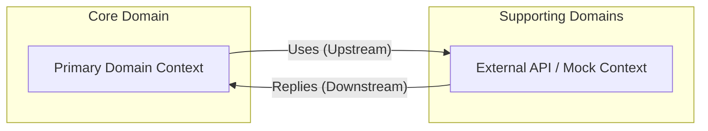
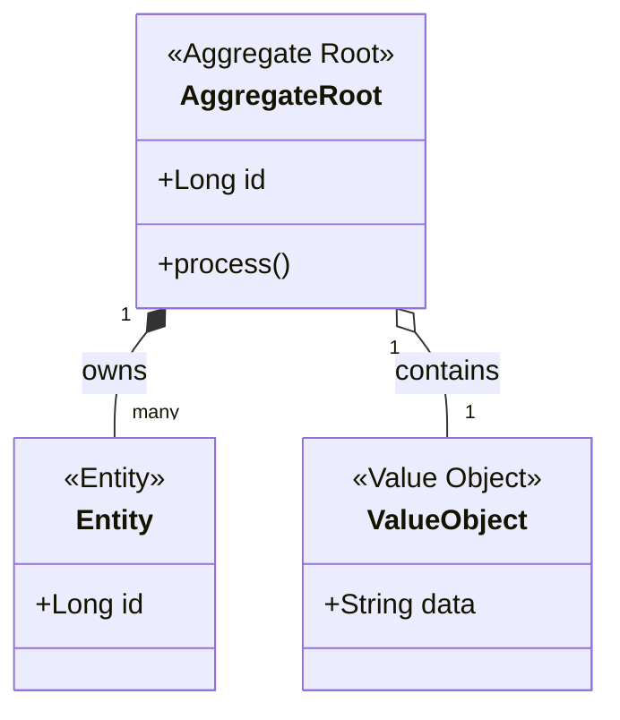
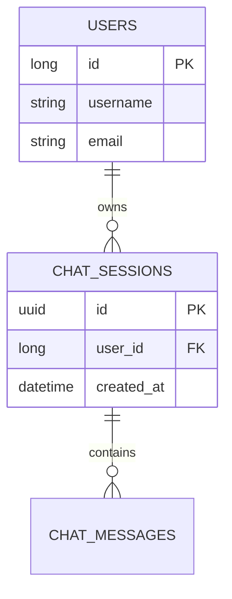
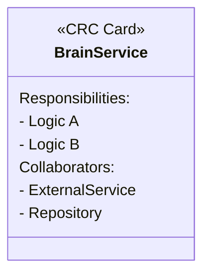
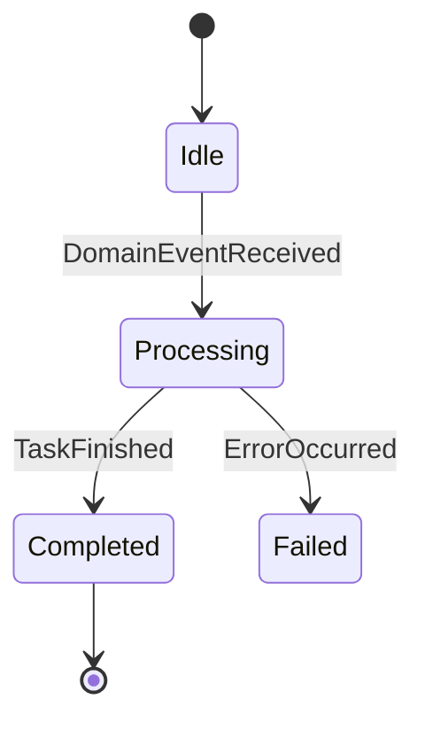

# Mermaid Architectural Templates for Java Spring Boot

Use these templates to ensure consistent, microservice-ready documentation across all 67 projects.

## 1. Bounded Context Map (`contextMap.mmd`)
**Purpose**: Defines service boundaries and external communication.

## 2. Aggregate Root Diagram (`aggregateDiagram.mmd`)
**Purpose**: Defines transactional boundaries and entity ownership.

## 3. Physical ER Diagram (`erDiagram.mmd`)
**Purpose**: Shows physical table connectivity and database schema.

## 4. CRC Cards (`crcCards.mmd`)
**Purpose**: Defines Responsibilities and Collaborators for core "Brain" logic.

## 5. Domain Event Flow (`eventFlow.mmd`)
**Purpose**: Visualizes async scaling and reactive state changes.

