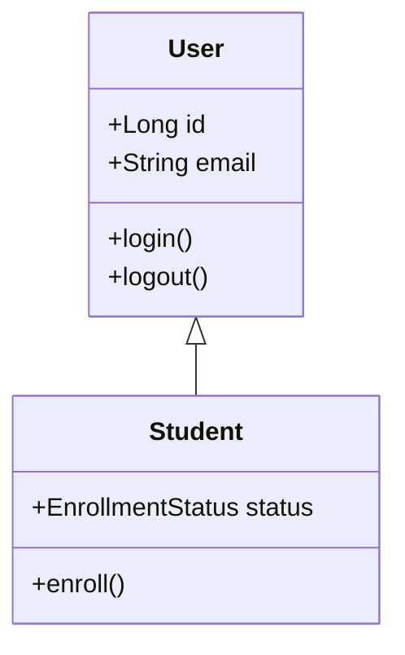
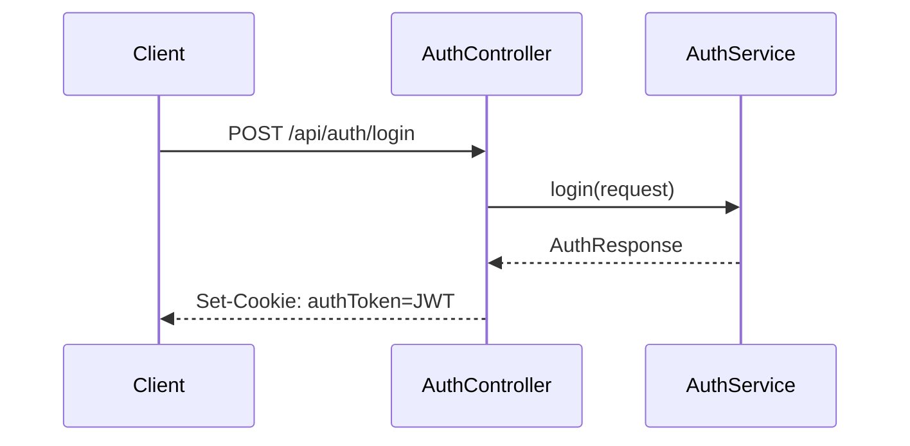
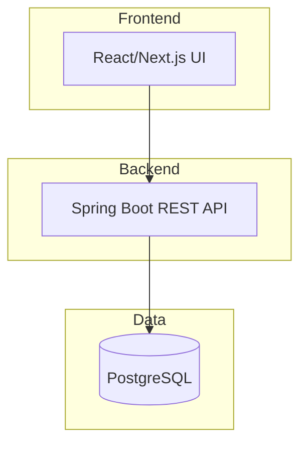

# Mermaid Diagrams

Generate professional architecture diagrams using Mermaid CLI. Use `npx @mermaid-js/mermaid-cli` if global install not available.

## Installation

```bash
# Use npx (always available)
npx --yes @mermaid-js/mermaid-cli --help

# Or install globally
npm install -g @mermaid-js/mermaid-cli
mmdc --version
```

## Usage

```bash
# Generate PNG (DEFAULT — this user prefers PNG; SVG is "difficult and problematic"
# to embed/host, so settle for PNG. Keep the ```mermaid fenced block in the README too,
# since GitHub renders it natively without any binary.)
mmdc -i diagram.mmd -o diagram.png -t neutral

# High resolution
mmdc -i diagram.mmd -o diagram.png -w 3000 -H 2000
```

> Avoid SVG for repo docs unless a consumer specifically needs a vector asset. This user
> explicitly asked to "settle for png" over svg.

## Diagram Types

### Class Diagram


### ER Diagram
```mermaid
erDiagram
    USER ||--o| STUDENT : "is a"
    TEACHER ||--o{ CLASS : "teaches"
    STUDENT }o--o{ CLASS : "enrolls in"
```

### Sequence Diagram


### Architecture


## Theme Options

- `default` — Light theme
- `dark` — Dark theme
- `forest` — Green tones
- `neutral` — Grayscale

## Pitfalls (learned from real use)

### Chrome / Puppeteer not found
`mmdc` renders via headless Chrome. If you see `Could not find Chrome (ver. ...)`, there is NO
system chromium on this box — do NOT assume `/usr/bin/chromium` exists. Fix:
- `npx puppeteer browsers install chrome-headless-shell` (downloads to ~/.cache/puppeteer)
- Then export the path to the downloaded binary:
  `export PUPPETEER_EXECUTABLE_PATH=$(find ~/.cache/puppeteer/chrome-headless-shell -name chrome-headless-shell -type f | head -1)`
- This exact two-step sequence is what works here; a bare `mmdc` without it errors every time.

### `note for X "quoted text"` is a parse error
The `note for` construct must NOT use a quoted string. Both FAIL with "Parse error on line N":
```
note for AP "Tarjan low-link DFS finds cut vertices"
note for H "Andrew monotone chain O(n log n)"
```
Use instead:
- Unquoted text (no quotes at all): `note for AP Tarjan low-link DFS finds cut vertices`
- Or drop `note for` entirely and use a plain node: `AP --> N[Tarjan low-link DFS finds cut vertices]`
  (plain nodes never hit the `note` parser quirk and render identically for a one-line caption).

### Apostrophes in node text
`'` (single quote) inside `[...]` also breaks the parser: `H[Andrew's monotone chain]` → parse error.
Replace with a space or rewrite: `H[Andrew monotone chain]`.

### Brackets / `=` / other special chars in node text
Mermaid's parser chokes on literal `=` and `[` `]` inside node/edge labels.
- `nums[i] = x` → `nums i equals x`
- `seen[complement]` → `seen complement`
- `<br/>` is fine in labels but keep special chars out of the surrounding text.

**CRITICAL — remove bracket chars from label TEXT, do NOT convert `[`→`(`:**
A stadium node `R([Return (best_sum)])` uses `([...])` as its shape. If you
rewrite `[`→`(`, the inner `(best_sum)` collides with the shape delimiter →
`Parse error ... got 'PS'`. Strip `[]{}()` from label text entirely; keep `([...])`
only as the deliberate shape wrapper. See `references/notebook-cell-diagrams.md`
for the exact `sanitize()` that removes these chars and the notebook-cell
extractor (classDiagram for classes, flowchart for functions).

### Batch rendering + verify (REQUIRED)
Loop over `.mmd` files; failures are SILENT (exit 0, no PNG). Always verify after:
```bash
export PUPPETEER_EXECUTABLE_PATH=$(find ~/.cache/puppeteer/chrome-headless-shell -name chrome-headless-shell -type f | head -1)
for f in *.mmd; do mmdc -i "$f" -o "${f%.mmd}.png" -t neutral -w 1600 2>/dev/null || echo "FAIL $f"; done
# Verify all rendered (count must match .mmd count)
for f in *.mmd; do [ ! -f "${f%.mmd}.png" ] && echo "MISSING: $f"; done
```
If a file is missing, re-run individually and read stderr (`head`) for the exact parse-error line.
Rendering is slow (~10-15s each); for many diagrams run in background and `wait`, do not block serially.

### Transparent background
`-b transparent` works with `-t dark` for clean embed in dark READMEs.

## Workflow: diagrams for a code repo README
1. Read the source files to extract real algorithm/struct names (don't invent).
2. Write `.mmd` sources in `docs/diagrams/`. For MANY units (e.g. one diagram per
   test/algorithm), generate them programmatically with
   `scripts/generate_sanitized_mmd.py` — it sanitizes all node text so you never hit
   the `[ ] ( ) = ' "` parser pitfalls, and emits a uniform flowchart per unit.
   Define `UNITS = { "Q1_twoSum": ("Title", ["step",...]), ... }` and run it.
3. Render ALL to `.png` (neutral theme). Do NOT default to SVG — this user wants PNG.
4. **Diagram FIRST in the README.** For user-facing repo docs this user wants the diagram ABOVE
   the prose: lead with the ```mermaid fenced block (GitHub renders it natively, no binary needed)
   AND embed the rendered PNG right after, THEN write the clone/run/test quick-start and the story.
   This "diagram-before-narrative" ordering makes the repo instantly scannable for anyone cloning it.
5. Reference both `.mmd` and the rendered image from the README so they're editable + viewable.
6. Commit both source and rendered output.

## Rendering diagrams INSIDE markdown tables (GitHub-specific — easy to get wrong)

A common ask: "put the diagram in the table" (summary table with a thumbnail per row, or one horizontal table per item). Markdown tables have two hard constraints GitHub enforces:

1. **`` image syntax does NOT render inside a table cell.** GitHub strips it. You must use a raw HTML `` tag instead — that DOES render in cells.
   - OK: `|  |`
   - FAIL: `|  |`
2. **A table cell must be a single physical line.** Any literal newline inside the cell breaks the row (the table splits). Collapse all multi-line content:
   - Replace newlines with `<br>` (GitHub renders `<br>` in cells).
   - Escape literal `|` as `\|` (a bare `|` inside a cell terminates the cell).
   - Keep code fences/lists OUT of cells — render steps as `<br>`-joined `` `code` `` spans.

**Horizontal per-item layout (proven, this user's preferred shape):**
- Summary Table at top: columns `# | Name | Kind | Complexity | Diagram( thumb) |`.
- Per-item section: one horizontal table per item — `| Diagram | # | Name | Complexity | Parameters | Returns | Key Steps(<br>-joined) | Links |`. The `` thumbnail sits in its own column inline.
- Thumbnail width: this user prefers **320px** (started at 220, asked to enlarge). Start at 320 for study-guide repos.

**Why this matters:** a per-cell `### heading + image + bullet list` stack is harder to scan than a horizontal table when you have 100+ items. The table form is what this user asked for ("Per-cell Explanation be in a horizontal table for easy readability").

## See Also
- `references/mermaid-cli-pitfalls.md` — Chrome/Puppeteer setup, forbidden chars in labels, batch-render verification.
- `references/notebook-cell-diagrams.md` — generate ONE diagram per notebook CODE CELL (classDiagram for classes, flowchart for functions) + parallel `xargs -P 4` render for 100+ diagrams + per-cell README layout. Use for "explain each cell of this notebook" study-guide tasks.
- `scripts/generate_sanitized_mmd.py` — emit many per-unit `.mmd` files with auto-sanitized node text (use for "one diagram per question/algorithm" repos).
